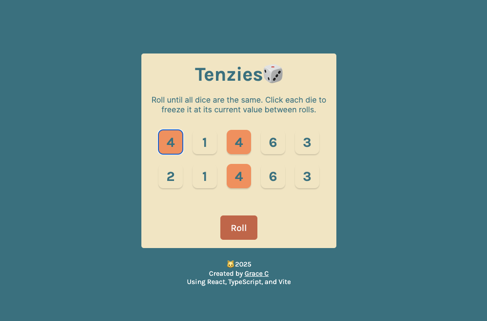

# Tenzies Game 🎲

A **fun and addictive dice game** built with **React** and **TypeScript**!  

🎯 Roll the dice until all show the **same number** – but with strategy and luck on your side! 🍀

<p align="center">
  
  &nbsp;
  
</p>

---

## ✨Features

- 🎲 **Interactive dice rolling**
- ✋ **Click to hold dice**
- 🎉 **Win celebration with confetti**
- 📱 **Responsive design** 
- 🛡️ **TypeScript-powered** for safer code

---

## 🕹️ How to Play

1. 🔁 Click **Roll** to roll all dice  
2. 🧊 Click on a die to **hold** it at its current value  
3. 🔄 Keep rolling until **all dice match**
4. 🎊 **You win!** Enjoy the confetti party!

---

## 🛠️ Built With

- ⚛️ React  
- 🧠 TypeScript  
- ⚡ Vite  
- 🎨 CSS  

---

## 🚀 Getting Started

```bash
npm install
npm run dev
